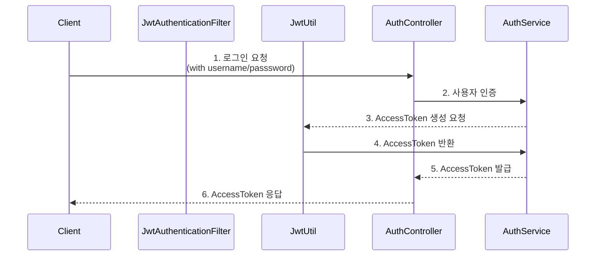
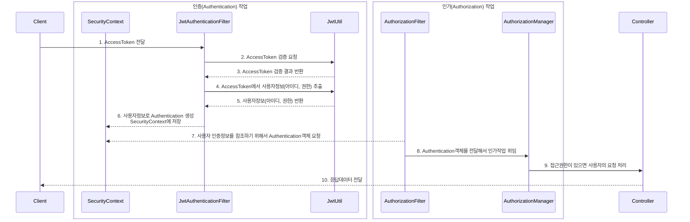

# Spring JWT 샘플
이 애플리케이션은 spring boot, spring web, spring security, jjwt, h2, spring data jpa 등을 활용해서 토큰 인증방식의 REST API 애플리케이션이다.

주요 기능 : 회원가입, 로그인, 할일 등록, 할일 조회, 할일 수정, 할일 삭제   

## 프로젝트 정보
- spring boot : 3.1.1
- java : 17
- build : maven
- packaging : jar
- groupId : com.example
- artifactId : spring-jwt

### 패키지 구조
- controller : 클라이언트의 요청을 처리하는 컨트롤러 클래스를 포함하는 패키지다.
  - AuthController.java : 사용자를 인증하고 JWT 토큰을 발행
  - TodoController.java : 할일 등록, 조회, 수정, 삭제 요청을 처리
  - UserController.java : 회원가입 요청을 처리
- model : 엔티티 정보를 표현하는 클래스를 포함하는 패키지다.
  - ERole.java : 권한정보
  - Todo.java : 할일 정보
  - User.java : 사용자 정보
- payload : 요청 데이터와 응답 데이터를 표현하는 클래스를 포함하는 패키지다.
  - auth : 인증에 필요한 정보를 표현하는 클래스를 포함하는 패키지다.
    + AuthRequest.java : 로그인 요청정보(username, password)
    + AuthResponse.java : JWT 토큰 응답정보(grantType, accessToken, refreshToken)
    + RefreshTokenRequest.java : 토큰 재발급 요청정보(refreshToken)
  - todo : 할일 등록, 조회, 수정에 필요한 정보를 표현하는 클래스를 포함하는 패키지다.
    + AddTodoRequest.java : 신규 할일 등록 요청정보
    + AddTodoResponse.java : 신규 할일 등록 응답정보
    + TodoResponse.java : 할일 조회 응답정보
    + UpdateTodoRequest.java : 할일 수정 요청정보
  - user : 회원가입에 필요한 정보를 표현하는 클래스를 포함하는 패키지다.
    + SignupUserRequest.java : 회원가입 요청정보
    + SignupUserResponse.java : 회원가입 응답정보
  - Response.java : 공통 응답정보
- repository : 데이터베이스 엑세스 작업을 표현하는 인터페이스를 포함하는 패키지다.
  - TodoRepository.java : 할일 정보 CRUD 제공
  - UserRepository.java : 사용자 정보 CRUD 제공
- security : 시큐리티 및 jwt 관련 클래스를 포함하는 패키지다.
  - JwtAuthenticationFilter.java : JWT를 활용해 사용자 인증을 처리하는 사용자정의 필터다.
  - JwtUtils.java : JWT 토큰을 생성, 검증, 정보 추출 기능을 제공하는 유틸리티 클래스다.
  - SecurityConfig.java : 스프링 시큐리티 설정 클래스다.
- service : 업무로직을 제공하는 클래스를 포함하는 패키지다.
  - AuthSerivce.java : 인증 서비스 제공 
  - TodoService.java : 할일 등록, 수정, 조회, 삭제 서비스 제공
  - UserService.java : 회원가입 서비스 제공
- AppConfig.java : 애플리케이션 실행에 필요한 빈을 등록시키는 클래스
- SpringJwtApplication.java : 스프링 부트 애플리케이션의 핵심 클래스

## JWT 로그인 요청

아이디/비밀번호를 전달하고, 엑세스 토큰을 발급받는다.

1. 요청 메세지에 아이디/비밀번호를 포함시켜 서버로 로그인 요청을 보낸다.
2. AuthRequest객체로 아이디/비밀번호를 받아서 AuthService.login(AuthRequest)를 호출한다.
3. AuthRequest로 전달받은 아이디/비밀번호로 사용자를 인증 작업을 수행하고, AccessToken을 생성을 요청한다.
4. JwtUtil은 AccessToken을 생성해서 반환한다.
5. AuthResponse객체에 AccessToken을 담아서 반환한다.
6. 응답을 보낸다.

## JWT 인증 

1. 클라이언트는 요청을 할 때마다 AccessToken을 요청헤더에 포함시켜 보낸다.
2. JwtAuthenctionFiler는 요청헤더에서 AccessToken를 가져온다. JwtUtil에 AccessToken의 유효성 검증을 요청한다.
3. JwtUtil은 검증결과를 반환한다.
4. JwtAuthenticationFilter은 JwtUtil에 사용자정보 추출을 요청한다.
5. JwtUtil은 사용자아이디, 권한정보를 추출해서 반환한다.
6. JwtAuthenticationFilter는 AccessToken에서 추출한 사용자 정보(아아디와 권한)로 Authentication객체를 생성하고, SecurityContext에 저장한다.
7. AuthorizationFilter는 인가작업 수행에 필요한 사용자정보가 포함된 Authentication객체를 가져온다.
8. AuthoriztionFilter는 AuthorizationManager에 Authorization을 전달해서 인가 작업을 위임한다.
9. AuthorizationManager는 접근권한을 가지고 있는지 검사하고, 접근권한이 있으면 사용자의 요청을 Spring MVC로 보낸다.
10. Spring MVC의 컨트롤러는 사용자의 요청을 처리하고 응답을 클라이언트로 보낸다.
